# Stadium Attack Animations

> [!WARNING]
> ## THIS PROJECT IS ENTIRELY AI VIBE-CODED
>
> This mod and its supporting research code were created through AI-assisted
> vibe coding. It is an experimental prototype, not a professionally engineered
> or authoritative Pokemon Stadium implementation. Expect inaccuracies, rough
> approximations, bugs, and code that may need substantial replacement.
>
> **This project is temporary and will be deleted once these effects are
> properly implemented by a skilled developer.** Until then, please treat every
> release as public test software and report problems rather than relying on it
> as a finished or faithful recreation.

Stadium Attack Animations is an experimental Gen1Recomp graphics mod that recreates
Pokemon Stadium move effects from a Pokemon Stadium ROM supplied by the
player. No ROM or extracted Nintendo asset is included in the mod or this
repository.

Version 0.5.1 implements a presentation for all 165 Gen 1 moves. The complete
registry is generated from Gen1Recomp's canonical move data and augmented with
each move's decoded Pokemon Stadium primary, alternate, impact, and resource
dispatch metadata.

Current development builds also separate that roster into move-shaped visual
programs and attack-camera timelines. Slash, punch, kick, grapple, rush,
needle, wind, sound, stream, wave, beam, storm, orb, leaf, electric, psychic,
drain, ground, barrier, heal, transform, and explosion programs replace the
old type-only fallback. Reusable melee, combo, ranged, sustained, aerial,
field, status, self, and explosion shots focus the body windup, travel, and
defender impact as distinct stages during Dramatic Shapes Stadium battles.

Thunder Shock retains its tested Stadium texture and schedule. Scratch, Sand
Attack, Thunder Wave, and the shared hit family also use exact cached Stadium
texture primitives. The remaining roster uses deterministic Stadium-style
rendering selected by type and behavior: contact, projectile, beam, multi-hit,
trapping, status, stat change, recovery, screen, charge, recoil, and explosion
presentations are all covered. These portable renderers are source-driven
interpretations and still need native Stadium capture calibration for exact
timing, scale, tint, and motion. Moves with no standalone Stadium VFX stage,
including Growl and Splash, retain their Dramatic Shapes body animation when a
Stadium model is showing.

## Animation showcase

These GIFs are clean captures from the version 0.5.0 renderer. They show one
representative move for each of the 15 Gen 1 attack types; they are not native
Pokemon Stadium footage.

| Normal | Fighting | Flying |
|:---:|:---:|:---:|
| **Hyper Beam**<br>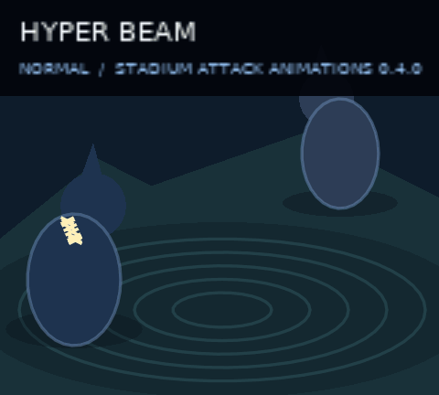 | **Submission**<br>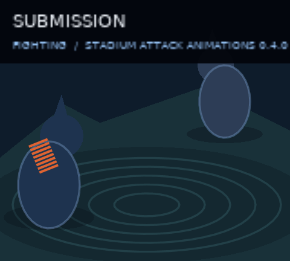 | **Wing Attack**<br>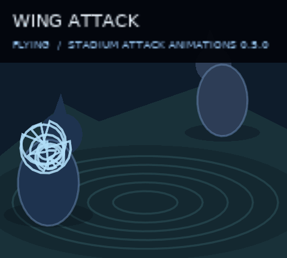 |
| Poison | Ground | Rock |
| **Acid**<br>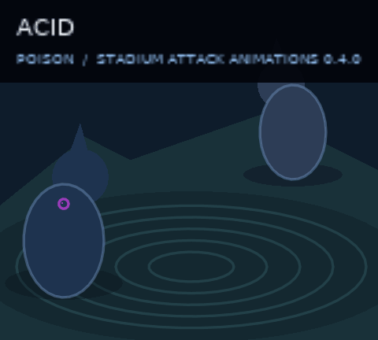 | **Bone Club**<br>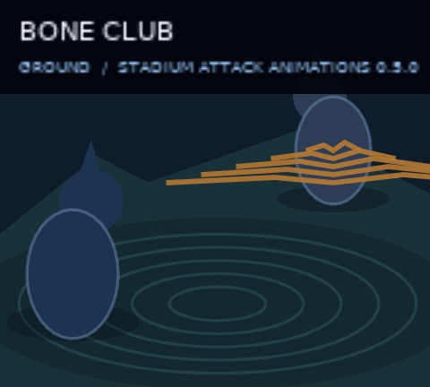 | **Rock Slide**<br>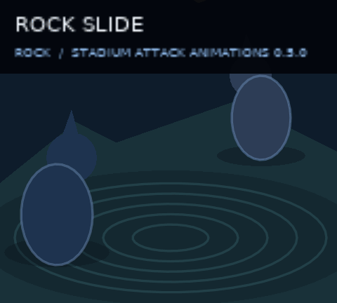 |
| Bug | Ghost | Fire |
| **Pin Missile**<br>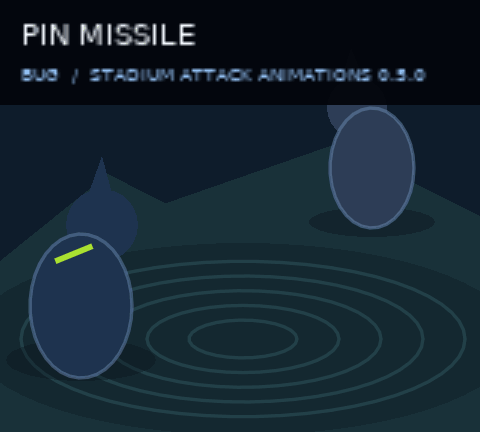 | **Night Shade**<br>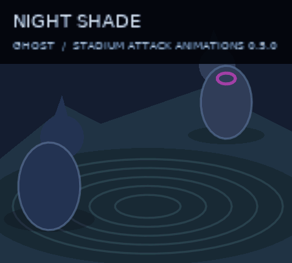 | **Fire Blast**<br>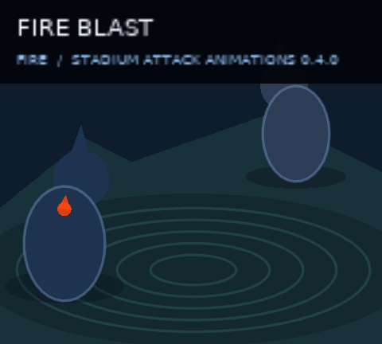 |
| Water | Grass | Electric |
| **Hydro Pump**<br>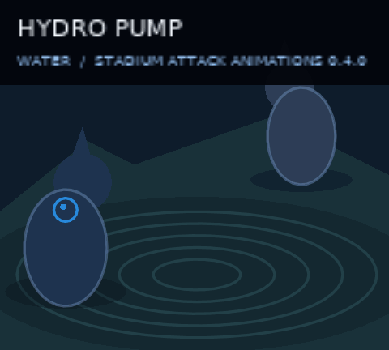 | **Razor Leaf**<br>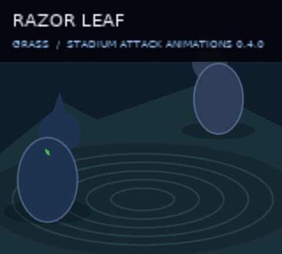 | **Thunderbolt**<br>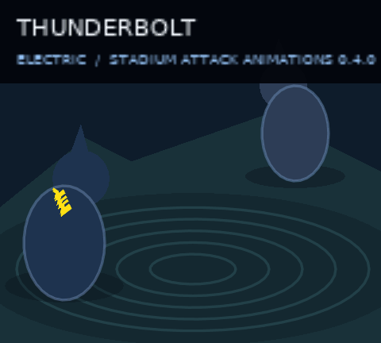 |
| Psychic | Ice | Dragon |
| **Psybeam**<br>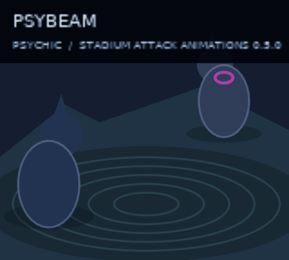 | **Ice Beam**<br>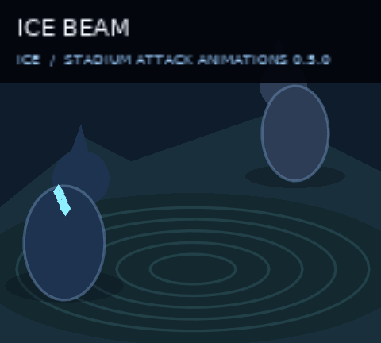 | **Dragon Rage**<br>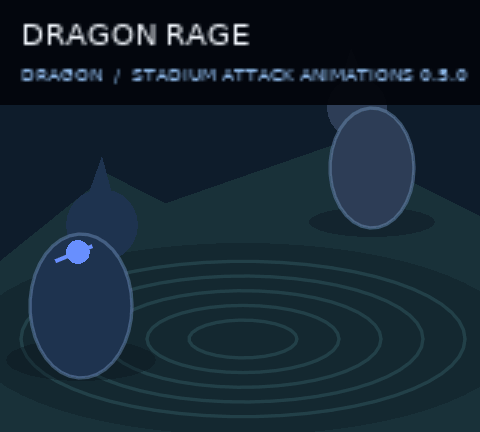 |

## ROM and cache

The supported cartridge is Pokemon Stadium (USA) v1.0, exactly 32 MiB. Put any
`.z64`, `.n64`, or `.v64` dump directly in the same flat `baseroms/` folder
Dramatic Shapes uses. The filename is not important:

```text
baseroms/baserom.z64
baseroms/my-stadium-cartridge.n64
baseroms/anything.v64
```

On the first overworld load, a dedicated **STADIUM ATTACK FX** screen extracts
and caches the small shared effect set. It advances one archive, cache, or GPU
upload operation per tick and closes automatically. Later boots load the cache
without showing the screen or rereading the ROM.

The private cache is stored under:

```text
stadium_battle_fx/effects/v2/
```

Its versioned marker is written last and records the size and checksum of each
primitive. Interrupted, incomplete, or stale caches are rejected and rebuilt.
The cache contains only eight small texture ranges, never the ROM, a complete
archive member, or a decompressed Stadium fragment.

## Dramatic Shapes compatibility

Dramatic Shapes is optional for textured attack effects and is required for
body-only Stadium presentations and the move-time attack camera. Stadium
Attack Animations reads its exported runtime state to determine whether a
Stadium model is showing and to let Dramatic Shapes finish its own first-run
model extraction screen first. It also reads the live voxel level,
staged-battle mode, projected shot scale, and model footprints. When the attack
camera is enabled, it composes a temporary move shot through Dramatic Shapes'
runtime camera function. When Dramatic Shapes owns the transformed animation
layer, this mod retains classic Gen1 effect anchors and lets Dramatic Shapes
apply the resulting camera transform exactly once.

This mod never writes to the Dramatic Shapes mod directory or its
cache. When a compatible successor fork exports
`Stadium.hit(side, effectiveness)`, landed damaging moves also request the
target model's Stadium skeletal reaction at the effect's `impactAt` frame.
Misses, immunities, and status-only moves do not request a reaction. The
integration is capability-checked and remains a safe no-op on older forks.

If the fork also exports `Stadium.faint(side, disposition)`, this mod requests
`collapse` for an unowned enemy in a wild encounter and `recall` for every
trainer-owned Pokemon, including the player's Pokemon. Dramatic Shapes still
owns HP-drain synchronization, model animation, and the return-to-ball visual.
Older forks keep their existing faint behavior.

This mod's only writes are to its private cache path above; it never writes to
the Dramatic Shapes mod directory or its `dramatic_shape/stadium/` cache.

Dynamic Battle Cinematics v0.7.1 is supported as an optional camera companion.
It replaces Dramatic Shapes' idle camera rig but does not replace the animation
player or animation layer. The move-time attack director composes after that
rig, while Dynamic Battle Cinematics returns to idle during committed actions.
Dramatic Shapes projects the resulting live shot and transforms Stadium Attack
Animations with the rest of the animation layer. Neither mod's files or saved
settings are modified. The optional **BC ZOOM OUT** setting widens Battle
Cinematics' complete battle framing by 10%, 25%, 35%, or 50%. It changes only
the optical field of view, so the companion's collision-safe camera path and
focus remain intact; **OFF** preserves its original framing.

## Installation and updates

Install the versioned `.modpkg` through Gen1Recomp's mod manager and enable
**Stadium Attack Animations**. The mod declares `engine_internals` for its narrow
AnimPlayer adapter and `filesystem` for ROM reads and its private cache.

The manifest points to `anxiousintrovert/StadiumBattleFX`. Tagged GitHub
releases publish a correctly named `.zip` asset, allowing Gen1Recomp's mod
manager to discover and install newer versions over the internet.

## Development

Run the Python research tests with a local cartridge:

```powershell
$env:STADIUM_ROM = "C:\path\to\Pokemon Stadium (USA).z64"
python -m unittest discover -s tests -p "test_*.py" -v
```

Build a runtime-only package with Gen1Recomp's ModKit:

```powershell
python tools/package_runtime.py `
  --modkit ..\Gen1Recomp\tools\modkit.py `
  --output dist\STADIUM_BATTLE_FX-0.5.1.modpkg
```

The allowlisted packer prevents ignored ROMs, saves, caches, captures, and
research-only tooling from entering a release.

## Research status

The move dispatch opcodes and resource bundles for all 165 moves are traced
from pret/pokestadium. Exact cached textures currently cover the established
traced subset; the rest use type/behavior-aware procedural presentations. The
current portable stage offsets, target anchors, scale, tint, and particle
motion remain provisional until they are compared against native Stadium
captures. See `docs/research.md` and
`docs/thunder-shock-trace.md` for the source trail. The generated
`docs/move-roster.md` covers all 165 Gen 1 moves, and `docs/effect-scale.md`
records the native scale and projection model used for roster expansion.
`docs/attack-cinematics.md` records the newly traced presentation layers,
camera source trail, shared-program model, and remaining calibration work.

Research references:

- Gen1Recomp — host engine and mod API
- DramaticShapeVoxelMod — read-only companion and extraction precedent
- pret/pokestadium — structural source for Stadium's battle effects
- PokemonStadiumRecomp — executable behavioral oracle
